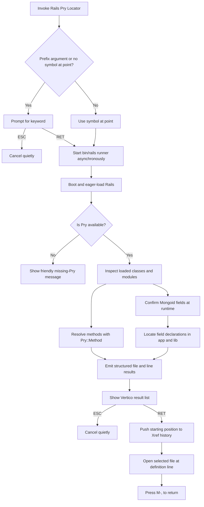

# Rails Pry Locator

`rails-pry-locator.el` finds method and Mongoid field definitions from a running Rails application context. It uses Pry's runtime method metadata, presents matching locations through Doom's Vertico completion UI, and records the starting position in Emacs's Xref history.

## Requirements

- A Rails project with an executable `bin/rails`.
- Pry available in the active Bundler environment.
- Mongoid when looking up `field` declarations.
- Doom Emacs with the Ruby module and Vertico enabled.
- Spring is optional. When available, `bin/rails runner` uses it to reduce repeated boot time.

The locator handles a missing Pry dependency without opening an error buffer. It displays `Pry is not available in this Rails bundle` instead.

## Loading

The Doom configuration loads the locator with:

```elisp
(load! "lisp/rails-pry-locator")
```

Reload that form or restart Doom after changing the locator.

## Shortcuts

| Action | Keys |
| --- | --- |
| Search the symbol at point immediately | `SPC m g p` |
| Prompt for a keyword | `SPC u SPC m g p` |
| Open the selected definition | `RET` |
| Cancel keyword entry or result selection | `ESC` |
| Return to the starting location | `M-,` |

`SPC u` is Doom's universal argument. In Evil normal mode, `C-u` scrolls upward and therefore does not request manual keyword entry.

## Search behavior

The keyword match is a case-insensitive substring match. For example, `assign` can return `Task.assign`, `Intervention.assign`, and methods containing `assignment`.

Method results come from `Pry::Method` metadata for eager-loaded modules. Results without a real project source file, such as generated `(eval ...)` locations, are excluded.

Mongoid does not retain the original source location for every generated field accessor. The locator therefore:

1. Confirms matching field names through loaded Mongoid model metadata.
2. Searches project Ruby files under `app/` and `lib/` for the corresponding `field` declaration.
3. Returns the declaration's actual file and line.

## Flow



## Result format

Vertico displays entries similar to:

```text
[field] field :accepted_at — app/models/task.rb:27
[method] Task.assign — app/models/task.rb:120
```

Only locations inside the current Rails project are returned.

## Failure behavior

| Condition | Behavior |
| --- | --- |
| Pry is absent | Show a short message; do not open an error buffer |
| No method or field matches | Show `No runtime method or Mongoid field matched` |
| `bin/rails` is missing or not executable | Raise a user-facing Emacs error |
| Rails runner fails | Display the process buffer for diagnosis |
| `ESC` is pressed in Vertico | Cancel without a process-sentinel error |
